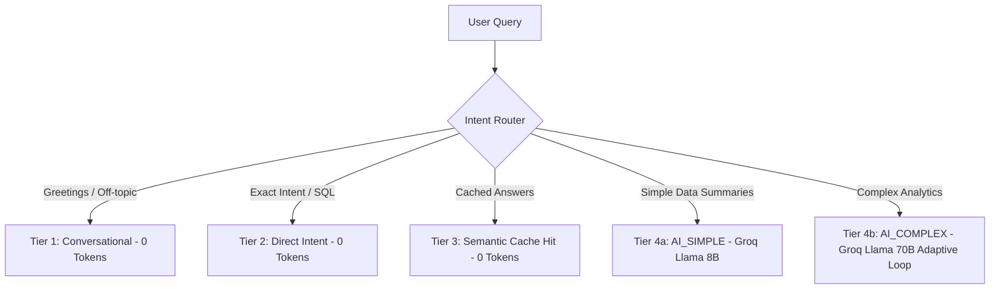

<div align="center">

# BizAssist
### AI-Powered Business Intelligence, POS & Accounting Ecosystem

[](https://github.com/rakshithananda18-cmyk/bizassist-billing)
[](#-running-tests)
[](https://python.org)
[](https://react.dev)
[](https://fastapi.tiangolo.com)
[](#)

*Offline-first POS, custom document labeling, double-entry ledgers with tamper-evident hash chains, multi-godown stock management, and a 4-tier cost-optimized AI advisor.*

---

[Quick Start](#-quick-start) • [Features](#-core-features) • [Architecture](#-architecture--ai-router) • [Testing](#-running-tests) • [Docs](#-key-documentation)

</div>

<br />

## 🌟 Overview

**BizAssist** is an enterprise-grade, offline-first business management platform designed for retail, wholesale, distribution, and service enterprises. It pairs a lightning-fast barcode POS counter with automated double-entry accounting, real-time stock intake, B2B supplier networking, and an LLM-driven business advisor.

---

## ⚡ Quick Start

### 1️⃣ Install Dependencies
```bash
.\dependencies.bat
```

### 2️⃣ Environment Setup
Copy the example environment file:
```bash
copy .env.example backend\.env
```
Ensure your `backend/.env` contains your key credentials:
```ini
GROQ_API_KEY=your_groq_api_key_here
JWT_SECRET=dev-test-secret-please-change-0123456789abcdef
DATABASE_URL=sqlite:///./bizassist.db
```

### 3️⃣ Launch Development Environment
```bash
.\start_dev.bat
```
> **Services Started:**  
> 🔹 **Backend API:** `http://localhost:8001`  
> 🔹 **POS Billing App:** `http://localhost:5174`  
> 🔹 **AI Dashboard:** `http://localhost:5173`

---

## ✨ Core Features

| Feature Module | Description & Capabilities |
| :--- | :--- |
| 🛒 **POS Billing Counter** | Barcode-first scanning, multi-tab carts, keyboard shortcuts, split payments (Cash, UPI QR, Card, Credit). |
| 🏷️ **Dynamic Labels (`useDocLabels`)** | Customize document names (*Sales Invoice*, *Credit Note*, *Debit Note*, *Voucher*). All UI & PDF headers update instantly. |
| 🔒 **Privacy & Security** | 1-click KPI blur mode for public counters, passcode lock with auto-lock inactivity timers. |
| 📜 **Audit Hash Chains** | Append-only double-entry ledger (`JournalEntry`) linked by SHA-256 cryptographic hash chains to detect database tampering. |
| 📦 **Stock Intake & Godowns** | Multi-item purchase intake grid with landed cost, batch expiry tracking, and multi-location warehouse transfers. |
| 🤝 **B2B Network & Price Tiers** | Connect buyers & suppliers via BizID codes; auto-apply *Wholesale*, *Distributor*, or *Standard* customer pricing tiers. |
| 🛡️ **Custom Confirm (`useConfirm`)** | Styled confirmation dialogs with field-level "Before vs. After" visual diffing when editing records. |
| 🔄 **Dual Hosting & Sync** | Seamless switching between offline local SQLite and cloud PostgreSQL with background delta sync queues. |

---

## 🤖 Architecture & AI Router

All user queries pass through a 4-tier cost-optimized intent router:



---

## 🧪 Seeding & Benchmarks

Generate load testing datasets and run query performance checks:

```bash
# Seed 10,000 invoices with full stock & journal ledgers
cd backend
..\venv\Scripts\python seed_load_test.py --count 10000

# Run latency benchmarks
..\venv\Scripts\python benchmark_reports.py
```

#### ⚡ Performance Summary (10,000 Invoices Load Test)
* 📊 **Day Book (Today / 1 Year)**: `3.89 ms` (Today) / `136.12 ms` (1-Year window, limit 200)
* 🧾 **Audit Journal (1 Year)**: `240.94 ms` *(2,000 entries pre-fetched)*
* 📈 **Profit & Loss (1 Year)**: `150.73 ms`
* 📦 **Stock Movement (1 Year)**: `91.14 ms` *(2,000 movements)*
* ⚖️ **Trial Balance & Balance Sheet**: `15.37 ms` (Balance Sheet) / `20.18 ms` (Trial Balance)

---

## 🧪 Running Tests

BizAssist includes a comprehensive dual test suite (970+ backend tests and 300+ frontend tests).

```bash
# Run both Backend & Frontend test suites in parallel
.\run_tests.bat fast

# Target specific test suites
.\run_tests.bat backend fast   # Pytest (backend)
.\run_tests.bat frontend       # Vitest (frontend)
```

---

## 📁 Repository Structure

```text
bizassist-billing/
├── backend/                  # FastAPI Python Service (API, Billing, Accounting, Sync, AI)
│   ├── core/                 # Business logic, command handlers, and algorithms
│   ├── database/             # SQLAlchemy schemas, models & migrations
│   ├── routes/               # API endpoints
│   └── tests/                # 970+ Pytest unit & integration tests
├── frontend-billing/         # Primary React POS & Billing Web App
│   ├── src/components/       # POS, Invoice, Stock & Modal components
│   ├── src/contexts/         # Auth, Confirm, & Theme providers
│   ├── src/hooks/            # useDocLabels, useConfirm, usePageLifecycle...
│   └── src/__tests__/        # 300+ Vitest component & unit tests
├── frontend-ai/              # AI Assistant & Analytics Dashboard
├── desktop/                  # Electron desktop wrapper & build scripts
├── docs/                     # Architecture, user guides & technical decision logs
├── run_tests.bat             # Fast test runner script
└── start_dev.bat             # Development server launcher
```

---

## 📖 Key Documentation

| Document | Content Summary |
| :--- | :--- |
| 📌 **[MASTER_PLAN.md](docs/MASTER_PLAN.md)** | Core vision, architectural decisions (D1–D10), roadmap. |
| 🏗️ **[ARCHITECTURE.md](docs/ARCHITECTURE.md)** | Layer-by-layer system architecture & data flows. |
| 🚀 **[SETUP_AND_DEPLOYMENT.md](docs/SETUP_AND_DEPLOYMENT.md)** | Local environment setup, Docker & cloud deployment guide. |
| 🧪 **[TESTING.md](docs/TESTING.md)** | Testing strategy, RLS tenant isolation & benchmark instructions. |
| 📘 **[USER_GUIDE.md](docs/USER_GUIDE.md)** | User manual for POS operations, custom labels, and AI queries. |
| 🏛️ **[FOUNDATION.md](backend/FOUNDATION.md)** | Backend conventions, tenant isolation, and transaction safety. |

---

<div align="center">
  <sub>Built with ❤️ for modern businesses • BizAssist Engine</sub>
</div>
