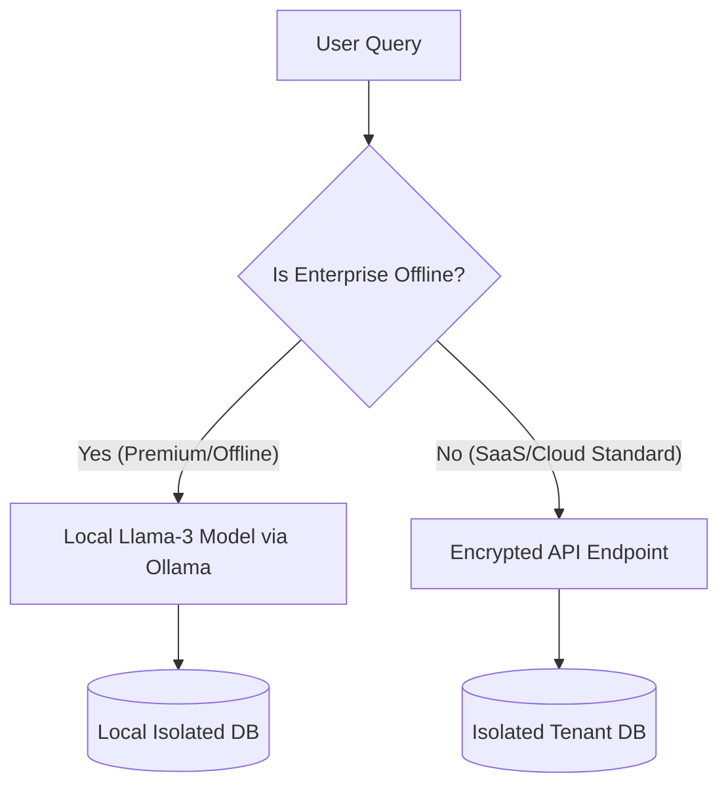

# Data Security & Deployment Comparison for BIZASSIST

This document compares different data security and model deployment strategies for **BIZASSIST** to help determine the best approach for retail business owners (pharmacies, supermarkets, and local stores).

---

## Comparative Analysis Table

| Strategy | Hardware Requirements | Data Security & Privacy | Speed & Latency | Setup Cost & Maintenance | Offline Capability |
| :--- | :--- | :--- | :--- | :--- | :--- |
| **Option A: Local LLM** (Ollama/Local GPU) | **High** (Needs 16GB+ RAM, dedicated GPU or Apple Silicon) | 🟢 **100% Secure** (No data leaves the shop's computer) | 🟡 **Slow to Medium** (Depends on local hardware) | 🔴 **High Setup** (Local installation & maintenance) | 🟢 **Yes** (Runs fully offline) |
| **Option B: Enterprise Private VPC / APIs** | **None** (Runs on any basic PC, tablet, or phone) | 🟢 **Enterprise Secure** (Strict SLA: no training, encrypted) | 🟢 **Very Fast** (1–2 seconds via high-end cloud GPUs) | 🟢 **Very Low** (Pay-as-you-go API consumption) | 🔴 **No** (Requires internet) |
| **Option C: Local PII Redaction** | **None** | 🟡 **Filtered Secure** (Scrubbed parameters, cloud reasoning) | 🟡 **Medium** (Added local scrubbing latency) | 🟡 **Medium** (Complex setup for name mappings) | 🔴 **No** |
| **Option D: Isolated Tenant DBs** (SaaS standard) | **None** | 🟢 **Tenant Isolated** (Physically separated databases) | 🟢 **Very Fast** (Smaller queries per DB) | 🟢 **Low** (Standard backend routing) | 🔴 **No** |

---

## Recommended Architecture: The Hybrid Security Standard

For a retail SaaS application targeting small-to-medium business owners (SMBs), **Option B (Enterprise Private APIs)** combined with **Option D (Isolated Tenant Databases)** is the **best and most viable approach**.

### Why this Combination is Best:

#### 1. Low Cost for Store Owners (Option B)
Local retail shops usually run on basic, low-spec billing computers or point-of-sale (POS) systems. 
* Asking a pharmacy owner to buy an expensive PC with a dedicated graphics card (Option A) to run a local model is a barrier to entry.
* Cloud API execution means BIZASSIST runs fast on **any device** (mobile, tablet, thin laptop) with zero hardware upgrades.

#### 2. Guaranteed Data Privacy (Option B)
When using business/enterprise endpoints (such as Anthropic/Groq developer APIs or AWS Bedrock/Azure OpenAI):
* The data is **never used to train models** (unlike the consumer versions of ChatGPT/Claude).
* The data is processed in memory and encrypted. You can legally guarantee to shop owners that their transactions are secure.

#### 3. Complete Data Isolation (Option D)
Instead of putting all stores in one giant database table, each business is assigned an isolated database schema or file (e.g. `store_2.db`).
* Even in the case of a coding mistake, it is physically impossible for Store A's query to access Store B's billing records.

---

## Transition Roadmap (Alternative for Offline/Enterprise Chains)

If you have specific high-security clients (e.g. large pharmacy chains) who require strictly zero-cloud data handling, you can offer a **Local On-Premises Edition** (Option A) as a premium tier:

