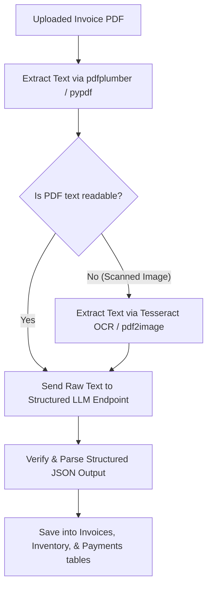

# Arbitrary PDF Invoice Parsing Blueprint for BIZASSIST

Real-world retail store owners receive invoices from various suppliers in completely different layouts. Traditional template-based PDF parsing (regex or spatial coordinate parsing) fails when layout formats shift. 

To support **any arbitrary PDF invoice layout**, the modern standard is a **hybrid PDF-to-Structured-JSON LLM pipeline**.

---

## 1. The Dynamic Parsing Architecture

Here is the data flow for extracting structured data from any arbitrary invoice PDF:



---

## 2. Target JSON Schema

No matter how the invoice looks, the LLM is instructed to map the contents to a standardized JSON schema matching BIZASSIST's database structure:

```json
{
  "invoice_id": "INV-2026-904",
  "supplier": "AstraZeneca India",
  "customer": "MediCare Pharmacy",
  "invoice_date": "2026-05-15",
  "due_date": "2026-06-15",
  "total_amount": 15450.00,
  "status": "Pending",
  "items": [
    {
      "product_name": "Paracetamol 500mg",
      "stock": 100,
      "expiry_date": "2028-12-01",
      "price_per_unit": 1.50
    },
    {
      "product_name": "Amoxicillin 250mg",
      "stock": 50,
      "expiry_date": "2027-06-01",
      "price_per_unit": 4.00
    }
  ]
}
```

---

## 3. Python Implementation Blueprint

Here is a ready-to-use Python service layout using `pdfplumber` and the OpenAI/Groq/Anthropic SDK's **Structured Outputs** (JSON Mode):

```python
import json
import pdfplumber
from pydantic import BaseModel, Field
from typing import List, Optional
from database.db import SessionLocal
from database.models import Invoice, Inventory, Payment, UploadedFile

# ── 1. Define Standard Extraction Schemas ─────────────────────────────
class InvoiceItemSchema(BaseModel):
    product_name: str = Field(description="Name of the product/item")
    stock: int = Field(description="Quantity purchased or stock quantity")
    expiry_date: Optional[str] = Field(description="Expiry date formatted as YYYY-MM-DD, or null")
    price_per_unit: float = Field(description="Unit price of the item")

class InvoiceExtractionSchema(BaseModel):
    invoice_id: str = Field(description="Invoice reference number or ID")
    supplier: str = Field(description="Company/Supplier selling the goods")
    customer: str = Field(description="Pharmacy/Business buying the goods")
    invoice_date: str = Field(description="Invoice date as YYYY-MM-DD")
    due_date: Optional[str] = Field(description="Payment due date as YYYY-MM-DD")
    total_amount: float = Field(description="Grand total amount of the invoice")
    status: str = Field(description="Status of invoice: 'Paid', 'Pending', or 'Overdue'")
    items: List[InvoiceItemSchema] = Field(description="List of all items bought in this invoice")

# ── 2. PDF Extraction Service ──────────────────────────────────────────
def parse_pdf_invoice(file_path: str) -> str:
    """Extracts raw text from the uploaded PDF file."""
    raw_text = ""
    with pdfplumber.open(file_path) as pdf:
        for page in pdf.pages:
            text = page.extract_text()
            if text:
                raw_text += text + "\n"
    return raw_text

# ── 3. Structured LLM Parser ───────────────────────────────────────────
def extract_structured_invoice_data(raw_pdf_text: str, client) -> InvoiceExtractionSchema:
    """Uses LLM with Structured Output / JSON schema to parse text."""
    
    prompt = (
        "Extract the structured billing and inventory items from the following raw text "
        "extracted from an invoice PDF. Map the values strictly to the schema rules.\n\n"
        f"Raw PDF Text:\n{raw_pdf_text}"
    )
    
    # Example using OpenAI Structured Outputs (ensure consistent schema enforcement)
    completion = client.beta.chat.completions.parse(
        model="gpt-4o-2024-08-06",
        messages=[
            {"role": "system", "content": "You are a precise data extractor."},
            {"role": "user", "content": prompt}
        ],
        response_format=InvoiceExtractionSchema,
    )
    
    return completion.choices[0].message.parsed

# ── 4. Save to Database Handler ───────────────────────────────────────
def save_extracted_invoice_to_db(data: InvoiceExtractionSchema, user_id: int, filename: str):
    """Saves structured output into standard BIZASSIST tables."""
    db = SessionLocal()
    try:
        # 1. Log file metadata
        file_log = UploadedFile(
            business_id=user_id,
            filename=filename,
            file_type="invoice",
            rows_count=len(data.items),
            upload_time=json.dumps({"uploaded_at": "today"})
        )
        db.add(file_log)
        db.commit()
        db.refresh(file_log)
        
        # 2. Add Invoice records
        for item in data.items:
            # Map products to Invoices table
            new_inv = Invoice(
                business_id=user_id,
                file_id=file_log.id,
                invoice_id=data.invoice_id,
                customer=data.customer,
                product=item.product_name,
                amount=item.price_per_unit * item.stock,
                status=data.status,
                invoice_date=data.invoice_date,
                due_date=data.due_date
            )
            db.add(new_inv)
            
            # Map products to Inventory stock
            new_stock = Inventory(
                business_id=user_id,
                file_id=file_log.id,
                product_name=item.product_name,
                stock=item.stock,
                expiry_date=item.expiry_date,
                supplier=data.supplier
            )
            db.add(new_stock)
            
        # 3. Add to Payments track
        new_pay = Payment(
            business_id=user_id,
            file_id=file_log.id,
            customer=data.customer,
            amount=data.total_amount,
            due_date=data.due_date,
            paid="Yes" if data.status == "Paid" else "No"
        )
        db.add(new_pay)
        
        db.commit()
    except Exception as e:
        db.rollback()
        raise e
    finally:
        db.close()
```
